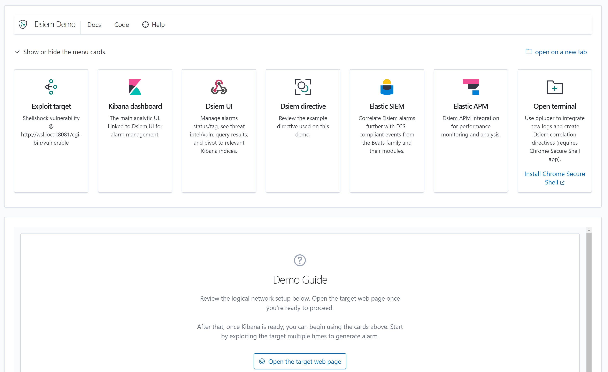

# Dsiem Demo

This is a docker compose environment that shows all Dsiem integration from one simple web interface. There is also a virtual machine version [available here](vagrant/).



The environment includes the following containers:

- Shellshock: an apache web server with CGI environment that is **vulnerable to [Shellshock](https://nvd.nist.gov/vuln/detail/CVE-2014-6271)**.
- Suricata: with ET signature to detect basic Shellshock exploit.
- Ossec: to detect file changes on /var/www/html (you know, defacement and stuff).
- Dsiem: preconfigured with a directive that correlates Suricata and Ossec events for the above scenario.
- Nesd: to host example Nessus scan result.
- Moloch Wise: to provide threat intelligence info.
- Elastic stack: Elasticsearch, Kibana, Logstash, Filebeat, Auditbeat, APM server.
- Dsiem demo frontend: the web app in the screenshot above.

## Requirements

- Docker and Docker Compose.
- Bash shell and common Unix utilities (grep, awk, etc. -- tested only on Linux and WSL).
- At least 4 CPU cores and 8 GB of RAM on the host machine.
- Disk space up to 5 GB to store all the docker images and generated logs/files.

## Usage

- Clone this repo using `git` or download the [zipped version](https://github.com/defenxor/dsiem/archive/master.zip).
- Execute `run.sh` script:

```shell
$ cd demo/
$ ./run.sh
```

And it will:

- Ask for the hostname/IP address that you can use to access the docker containers from a browser (which depends on the network and/or NAT setup).
- Run `docker-compose up`
- Perform all necessary checks and initial setup (like uploading Kibana dashboard, index templates, etc.) required. Be aware that the script will run `sudo chown` once to change the file owner of the demo filebeat configuration files to `root`.

Example script run:

```shell
$ ./run.sh
** DSIEM DEMO **

Which network interface will be accessible by your browser? [wlp60s0 docker0 vboxnet0]: wlp60s0
What is the hostname/IP that your browser will use to access the demo web interface? [192.168.123.134]:

**
The demo web interface will be setup to listen on wlp60s0 (192.168.123.134), and you will use
http://192.168.123.134:8000 to access it.

Any network address translation and routing in-between this docker server and your browser must
allow the above to happen.

Press any key to confirm the above and continue, or CTRL-C to abort.
**
** making sure beat config files are owned by root .. done
Creating network "docker_siemnet" with driver "bridge"
Creating volume "docker_filebeat-data" with default driver
Creating volume "docker_filebeat-es-data" with default driver
Creating volume "docker_es-data" with default driver
Creating volume "docker_dsiem-log" with default driver
Creating volume "docker_suricata-log" with default driver
Creating volume "docker_apache-log" with default driver
Creating volume "docker_apache-html" with default driver
Creating volume "docker_ossec-data" with default driver
Creating kibana              ... done
Creating dsiem-demo-frontend ... done
Creating dsiem               ... done
Creating apm                 ... done
Creating dsiem-nesd          ... done
Creating filebeat            ... done
Creating auditbeat           ... done
Creating wise                ... done
Creating suricata            ... done
Creating elasticsearch       ... done
Creating ossec               ... done
Creating filebeat-es         ... done
Creating shellshock          ... done
Creating logstash            ... done
** finding target IP address .. done
** preparing nesd CSV file .. done
** verifying 172.28.128.5 in Wise .. done
** verifying 192.168.99.6:8081 in Nesd .. done
** ensuring elasticsearch is ready .. done
** preparing es indices .. done
** setting up suricata interface .. done
** making sure target is ready .. done
** ensuring logstash is ready .. done
** ensuring filebeat-es index template is correctly installed .. done
** ensuring filebeat-es uses the correct mapping .. done
** setting ossec syslog destination to logstash IP (192.168.99.7) .. done
** ossec initialization .. done
** ossec integrity check logging .. done
** waiting for suricata index to become available .. done
** waiting for ossec index to become available .. done
** waiting kibana to become ready .. done
** installing kibana dashboards .. done
** installing additional kibana index patterns .. done
** removing test entries .. done

Demo is ready, access the web interface from http://172.28.128.5:8000/

(Press CTRL-C to tear down the demo and exit)
```

Once the script says the above, you can start using the demo web app by opening the provided link in a browser. Chrome users will get an extra "Open Terminal" menu that is linked to [Secure Shell app](https://chrome.google.com/webstore/detail/secure-shell-app/pnhechapfaindjhompbnflcldabbghjo).

## Updating

The demo environment might be updated in the future to add more example directives or to keep up with changes in Elastic stack. Here are the steps to make sure you're running the latest version of the demo environment:

```shell
$ cd dsiem/demo
$ git pull
$ ./run.sh pull
```

## Clean up

CTRC-C on a running `run.sh` script will automatically stop the containers and remove their data volume. But if somehow that doesn't work, you can execute `run.sh down` separately to achieve the same result.

To completely remove the demo you will also need to delete all docker images listed in [docker-compose.yml](docker/docker-compose.yml). Something like this should work from the demo directory:

```shell
$ awk '/image:/{print $2}' docker/docker-compose.yml | xargs docker rmi
```
