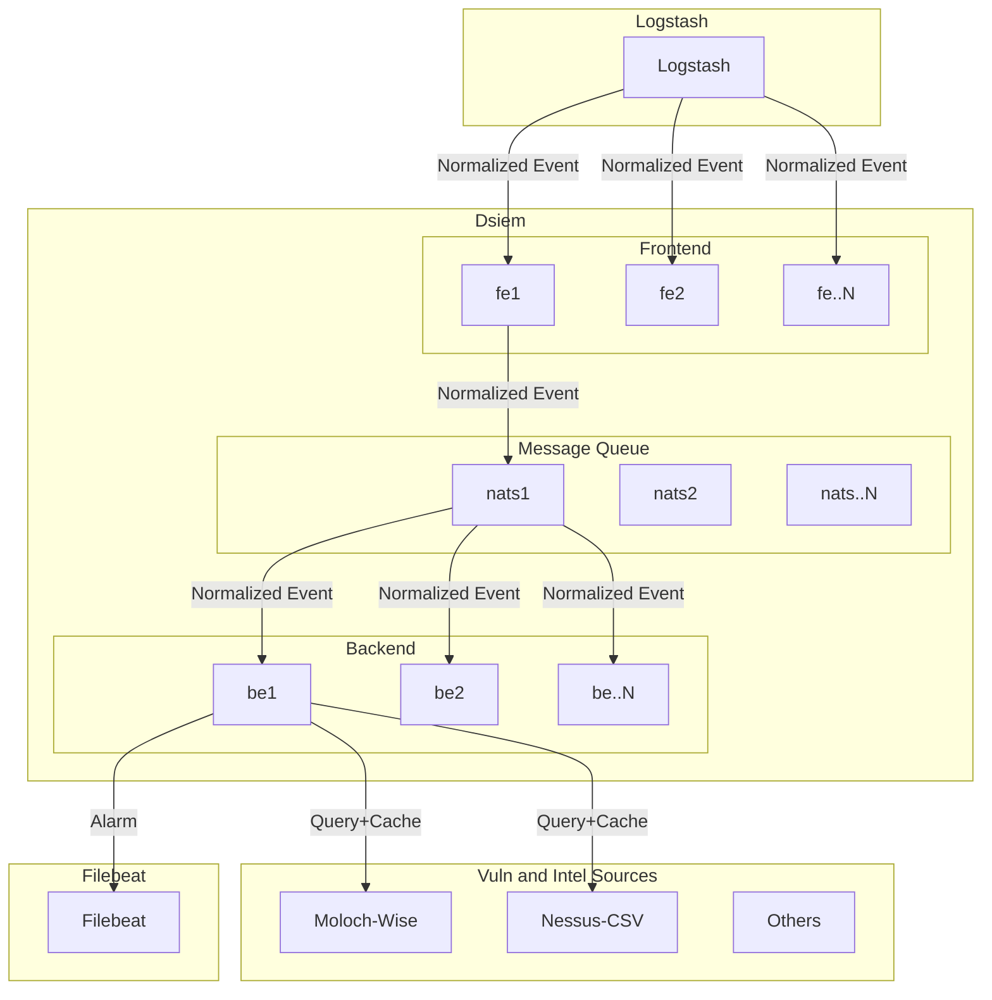

# Advanced Deployment

Dsiem supports clustering mode for horizontal scalability. In this mode, each instance of dsiem will run either as frontend or backend node, with NATS messaging in between to facilitate communication. The architecture is depicted in the following diagram.



## About the Architecture

* Frontend nodes are responsible for validating and parsing incoming normalized events from Logstash, and forwarding results to backend nodes through NATS messaging system. Since frontends do not maintain states, Logstash can be easily configured to load balance between them (for example, using DNS round-robin or Kubernetes load balancer).

* Each backend node is assigned with a different set of (exclusive) directive rules to use for processing events. For example, a directive rule for detecting port scan maybe assigned only to backend A, and another directive that alert on SSH failed logins maybe assigned only to backend B. This simple way of distributing workload means that all backends can work independently, using an in memory storage, and do not have to sync states with each other.

* That however, does entail that *every* event sent from frontends will have to be delivered/broadcasted to all backends in order to evaluate them against all rules. This could potentially introduce network bottleneck from NATS to backends. It also means that the rules assigned to a failing backend will not be picked up by other nodes.

* For now we consider the above drawbacks acceptable and somewhat manageable (for instance through network configuration), given that the alternative method of distributing event processing between backends seem to require maintaining shared states: a pattern that will introduce much greater complexity and likely performance penalty.

## Configuration

Example cluster mode configuration is provided <a href="https://github.com/defenxor/dsiem/blob/master/deployments/docker/docker-compose-cluster.yml">here</a>. To try it out just follow the [Installation](./Installation.md#using-docker-compose)  guide, and use the following command to execute `docker-compose up`:

    ```shell
    cd dsiem/deployments/docker && \
    docker-compose -f docker-compose-cluster.yml up
    ```

Locations of all web interface endpoints (Kibana, Elasticsearch, Dsiem) are the same as in the standalone mode.

### Distributing Work Between Backends

In `cluster-backend` mode, dsiem will pull files from frontend `configs` directory into its own, but will *only* fetch directives files whose name matches its `node` startup parameter.
  
For instance, in the example `docker-compose-cluster.yml` above, backend container is started with `DSIEM_NODE` environment variable set to `dsiem-backend`. That tells dsiem to only fetch directive files that matches *directives_**dsiem-backend**_\*.json* glob pattern from frontend node.

Therefore to distribute loads between backend nodes, you will need to:
* Start each backend with a unique `node` parameter;
* Split your directives into separate files;
* Name those files according to that glob pattern; and
* Have those files available in all frontend nodes `configs` directory.

### Deployment on Kubernetes

Dsiem should run on any container orchestration engine, including Kubernetes. The following lists our recommendation for running dsiem on K8s:

* For frontend nodes:
  - To centrally manage directive files, use a shared storage (e.g. NFS, CIFS) on frontend nodes to mount `configs` directory. This is only read once during startup so I/O performance here shouldn't be an issue.
  - For high availability and load balancing, create a K8s service for frontends and have logstash instances send logs to that service.
  - Frontends don't need permanent storage, so you can use [Deployment](https://kubernetes.io/docs/concepts/workloads/controllers/deployment/) to schedule and manage them.

* For backend nodes:
  - Use [StatefulSets](https://kubernetes.io/docs/concepts/workloads/controllers/statefulset/) to have a stable/predictable pod names, and use the pod name to set `DSIEM_NODE` container environment variable. This allows you to distribute work among backends by naming the directive files (located in frontend nodes) based on the backend StatefulSet's pod name prefix and number of replicas.

  - Mount a persistent storage for backend `logs` directory, and have a filebeat container in the same pod to harvest those logs. Have a look at how this is done in the docker compose examples as a starting point.
