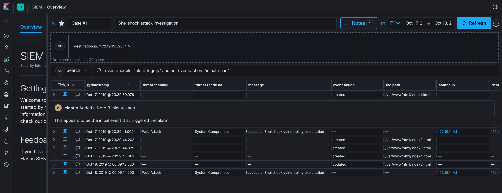

# Elastic SIEM Integration

Elastic stack 7.2 and newer versions include a [SIEM app in Kibana](https://www.elastic.co/guide/en/kibana/current/xpack-siem.html) that provides an interactive workspace for security teams to triage events and perform initial investigations.

Integrating Dsiem into the app allows us to analyze Dsiem alarms data in it, and to further correlate those alarms and other compatible log entries such as those coming from Filebeat, Winlogbeat, Auditbeat, and others.

The following picture shows an example of an Elastic SIEM timeline analyzing potential connection between Dsiem alarms and several auditbeat logs.

## Dsiem Filebeat Module

Elastic SIEM app reads data from [Elastic Common Schema - ECS](https://www.elastic.co/guide/en/ecs/current/index.html) compliant documents stored in Elasticsearch indices.

From a practical stand point, we can transform Dsiem alarms data into ECS format using either a Logstash filter, a Filebeat module, or a dedicated custom Beat. For now we opt to use the Filebeat module approach for its builtin support for ECS fields compared to a Logstash filter, and for its lower maintenance compared to a custom Beat.

The Docker Compose environment created in the [installation guide](https://github.com/defenxor/dsiem/blob/master/docs/installation.md#using-docker-compose) already has Filebeat module for Dsiem enabled, so you can directly play with it by visiting http://localhost:5601/app/siem#/hosts/events. In that environment, all generated alarms should be visible in both Dsiem web UI and Kibana SIEM app.

For reference, the Filebeat module for Dsiem files are located [here](https://github.com/defenxor/dsiem/tree/master/deployments/docker/conf/filebeat-es/).
