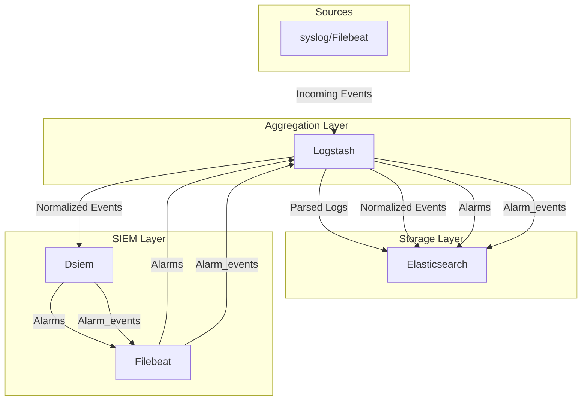

# Event Processing Flow

This section provides more details on how event processing works in Dsiem, compared to the rather simplified version description on the main [Readme](https://github.com/defenxor/dsiem/#how-it-works). We'll use the following diagram and <a href="https://github.com/defenxor/dsiem/tree/master/deployments/docker/conf/">Dsiem example Logstash and Filebeat configuration files</a> as reference.

The diagram shows how logstash plays a central role in the event flow. It is therefore important to get an idea of how it works first before diving further. The basic things to understand are:

  * Logstash processing pipeline progresses from input ⟶ filter ⟶ output. More detail on this can be found on the Logstash documentation on <a href="https://www.elastic.co/guide/en/logstash/current/pipeline.html">how it works</a>.

  * Logstash <a href="https://discuss.elastic.co/t/logstash-priority-order-when-using-multiple-config-files/80507">reads configuration files in alphabetical order</a>. Dsiem <a href="https://github.com/defenxor/dsiem/tree/master/deployments/docker/conf/logstash/conf.d">example configuration files</a> use this fact to construct the appropriate pipeline.

With that in mind, let's break down how event flows throughout the system.

## Processing Initial Events

First, logs are received by Syslog/Filebeat, and are sent (`Incoming Events` in the diagram) to Logstash with a unique identifier. On the example config file, Filebeat adds field <a href="https://github.com/defenxor/dsiem/blob/fbf98d55d6b6dd2414a76a84964cb6c9719d7f58/deployments/docker/conf/filebeat/filebeat.yml#L33">`{application: suricata}`</a> to the event for this purpose.

Logstash receives the event through <a href="https://github.com/defenxor/dsiem/blob/master/deployments/docker/conf/logstash/conf.d/00_input.conf">00_input.conf</a>, and process it separately from other events in file <a href="https://github.com/defenxor/dsiem/blob/master/deployments/docker/conf/logstash/conf.d/50_suricata.conf"> 50_suricata.conf</a> based on the presence of `[application] == suricata` field.

After that, still based on the same unique identifier, the event is then processed by <a href="https://github.com/defenxor/dsiem/blob/master/deployments/docker/conf/logstash/conf.d/70_siem-plugin-suricata.conf">70_siem-plugin-suricata.conf</a>, followed by <a href="https://github.com/defenxor/dsiem/blob/master/deployments/docker/conf/logstash/conf.d/99_output.conf">99_output.conf</a>.

`70_siem-plugin-suricata.conf` *clone* the event, and remove the `[application] == suricata` identifier from the clone so that it will not be processed by `99_output.conf`.

`99_output.conf` in turn process the original event and send it to Elasticsearch (`Parsed Logs` in the diagram) to be stored in a device-specific index, which in this case `suricata-*`. At this point the processing flow of the initial event is complete.

## Processing Cloned ⟶ Normalized Events

As for the cloned event, `70_siem-plugin-suricata.conf` converts it into a `Normalized Event`. This is a standardized format that has a set of common fields shared by all incoming events such as Source IP, Destination IP, Title, and others. The full list of fields of a `Normalized Event` is shown [here](./dsiem_plugin.md#normalized-event).

In addition to converting the cloned event to a normalized event format, `70_siem-plugin-suricata.conf` also adds field `"[@metadata][siem_data_type]" => "normalizedEvent"` to become the new event identifier.

the cloned event is then picked up based on that new identifier by <a href="https://github.com/defenxor/dsiem/blob/master/deployments/docker/conf/logstash/conf.d/80_siem.conf">80_siem.conf</a>. In there, a copy of the cloned event is sent to Elasticsearch for final storage in `siem_events-*` index, and another copy is sent to Dsiem for event correlation. At this point, the processing flow of the cloned event is complete.

## Generating Alarms

Dsiem performs event correlation on all incoming `Normalized Event` based on its configured directive rules. Dsiem generates `Alarm` if the directive rule condition are met by a series of incoming events within a given period of time. Refer to [Directive and Alarm](./directive_and_alarm.md) doc for more detail on how alarms are generated. 

Dsiem stores generated `Alarm` and subsequent updates to it in a log file which is then harvested by a local Filebeat. In addition to the alarm itself, Dsiem also stores `Alarm_events` records that link each alarm to the `Normalized Events` that trigger its creation. Just like `Alarm`, those records are also harvested by the local Filebeat instance.

## Processing Alarms

Dsiem's Filebeat sends both `Alarm` and `Alarm_events` record back to Logstash. Filebeat adds extra field `{application: siem, siem_data_type: alarms}` and `{application: siem, siem_data_type: alarm_events}` to uniquely identify each of them (shown <a href="https://github.com/defenxor/dsiem/blob/fbf98d55d6b6dd2414a76a84964cb6c9719d7f58/deployments/docker/conf/filebeat/filebeat.yml#L6">here</a> and <a href="https://github.com/defenxor/dsiem/blob/fbf98d55d6b6dd2414a76a84964cb6c9719d7f58/deployments/docker/conf/filebeat/filebeat.yml#L15">here</a>).

Upon receiving those, Logstash config file <a href="https://github.com/defenxor/dsiem/blob/fbf98d55d6b6dd2414a76a84964cb6c9719d7f58/deployments/docker/conf/logstash/conf.d/80_siem.conf#L40">80_siem.conf</a> then perform minor clean-up and formatting, before sending them to the final storage destination, namely elasticsearch index `siem_alarm_events-*` and `siem_alarms`.

## Implications
For practical purposes, the processing flow described above means that the following guide should be followed:

* All SIEM plugins (i.e. output of `dpluger` tool) file name should start with a number that is less than 80, for example `70_siem-plugin-suricata.conf`. This is to ensure that they will all be read before `80_siem.conf`.

* All log sources filters must be put in a file whose name starts with a number that is less than all the SIEM plugins name. For example if the SIEM plugins names start with 70_\*, then the log source filters should start with 60_\* or 50_\* (like `50_suricata.conf` in the above example). This ensures that they will all be read before the SIEM plugins that expect to clone their results.
