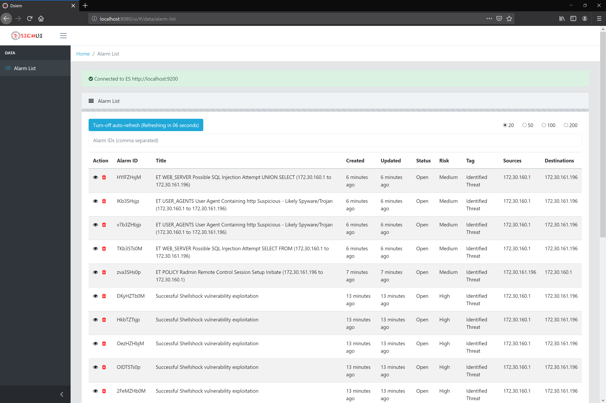
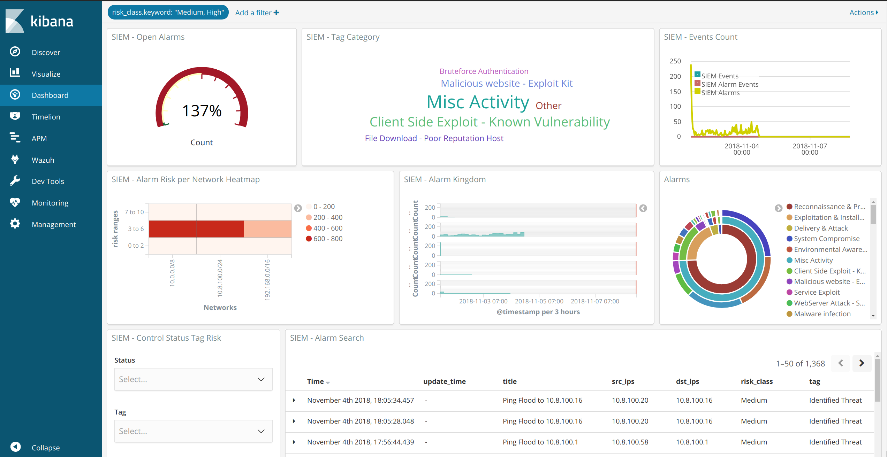
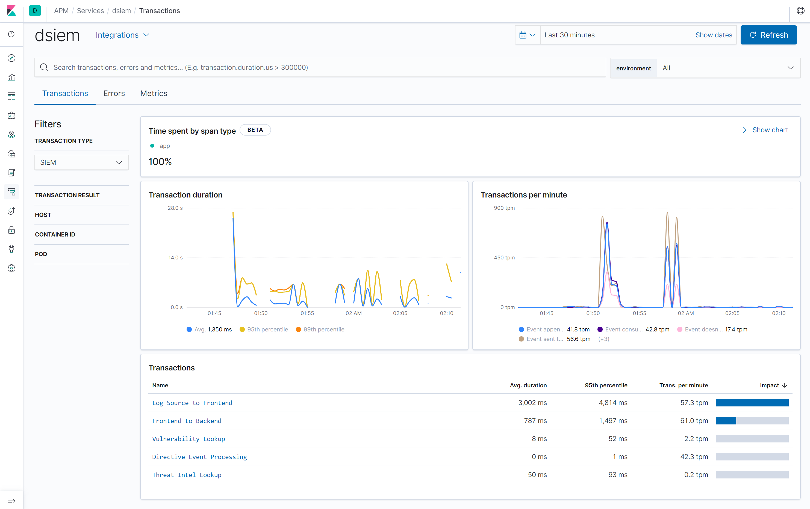

# Web Interfaces

Dsiem comes with an Angular-based web UI for managing alarms and quick pivoting to the relevant sections in Kibana for further analysis. In addition, there's also an example Kibana dashboard ready for import, and Elastic APM integration for performance monitoring.

## Dsiem Web UI

The web UI is accessible from http://dsiem-address:8080/ui/.



You can click on an alarm to see its detail. Then from there you can interact with the following cell:
* **Status**: to change the alarm Status from `Open` to `In-Progress` or `Closed`.
* **Tag**: to change the alarm's tag from `Identified Threat` to `False Positive`, `Valid Threat`, or `Security Incident`.

The above statuses and tags can be customized by supplying the appropriate dsiem [startup parameter](./commands.md#dsiem-command-flags).

Several cells on the detail alarm view also provide clickable link to quickly search their content on Kibana for further analysis.

## Kibana Dashboard

Dsiem's example Kibana dashboard can be imported using the step provided [here](./installation.md#importing-kibana-dashboard). The result should be similar to this:



The dashboard also provide a URL link (through Kibana scripted field) to open each alarm on Dsiem web UI.

## APM Integration

***Note:** APM support requires ELK stack v6.5 or later.*

Dsiem comes integrated with Elastic APM for tracing purpose. Currently there are 5 custom transaction types created by Dsiem:

* Log Source to Frontend: measures the time it took for the event to reach Dsiem frontend. This is calculated as the `event's arrival time - the event's timestamp`.
* Frontend to Backend: measures the network transit time (including processing time by NATS ) between frontend and backend.
* Directive Event Processing: measures how long an event is processed by backend's backlog.
* Threat Intel Lookup: measures how long threat intel plugins process lookup request.
* Vulnerability Lookup: measures how long vulnerability lookup plugins process lookup request.

To enable APM integration, start Dsiem node with the following environment variables:

```shell
$ export ELASTIC_APM_SERVER_URL="http://[your-APM-server-address]:8200"
$ export ELASTIC_APM_SERVICE_NAME="dsiem"
$ export ELASTIC_APM_ACTIVE="true"
$ export DSIEM_APM="true"
$ ./dsiem serve
```
Example screenshot of Dsiem's APM dashboard:



**Caveats on current APM support:**
- Dsiem currently doesn't support distributed tracing due to difficulty in passing APM trace context from
  frontend to backend. We can use spans and pass APM `trace ID` or (whatever identifier required) 
  along with dsiem normalized event object, but it is not clear how to instantiate APM transactions (or spans)
  on the backend node that will correlate with the one recorded on the frontend.
